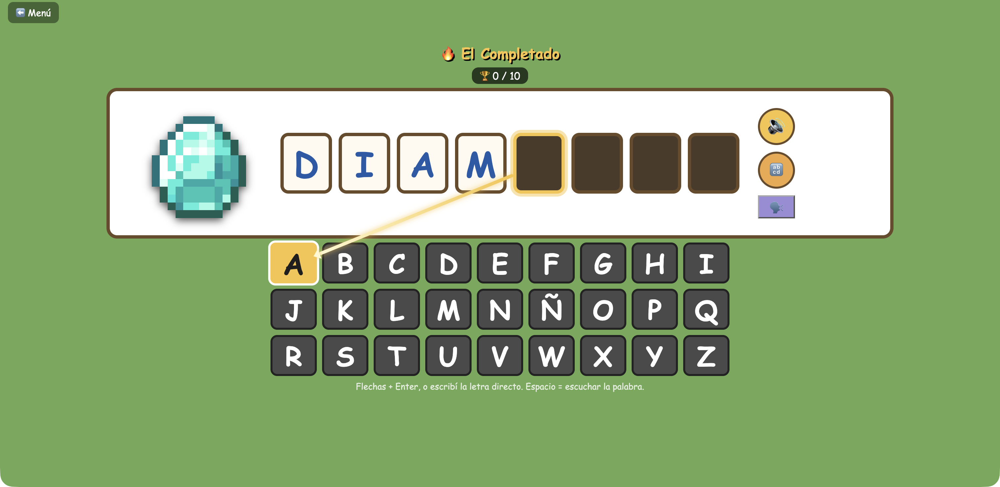

# Minecraft ABC

Juegos web simples para que los más chicos aprendan a leer, usando imágenes reales de items y bloques de Minecraft como excusa.

Es un menú (hub) al que se le van a ir agregando juegos con el tiempo. El primero es **El Completado**.



## El Completado

Se muestra una imagen de Minecraft (un diamante, una antorcha, un cofre...) junto a su nombre en español, con algunas letras ya visibles y el resto en blanco. Hay que completar las letras que faltan, siempre de izquierda a derecha, usando el abecedario que aparece abajo.

Controles:
- Flechas para mover el cursor sobre el abecedario + Enter para confirmar, o
- Escribir la letra directamente en el teclado
- Espacio: escuchar la palabra completa (doble espacio rápido: escucharla separada en sílabas)
- Botones al costado del tablero: 🔊 escuchar completa, 🔡 escuchar por sílabas, 🗣️ cambiar de voz

Cada letra correcta suma un casillero resaltado con una línea que apunta a la tecla elegida. Al completar una palabra aparece una flecha ➡️ para pasar a la siguiente (no avanza solo). Una ronda son 10 palabras.

## Cómo jugarlo

Es HTML/CSS/JS sin build ni dependencias. Basta con abrir `index.html` en el navegador, o levantar un servidor simple para jugarlo desde otro dispositivo en la misma red:

```bash
python3 -m http.server 8000
```

Y entrar a `http://<tu-ip-local>:8000/` desde cualquier compu o tablet conectada al mismo wifi.

## Estructura

```
index.html          → menú principal (hub)
hub.css
juegos/
  el-completado/    → el juego descripto arriba
assets/img/         → imágenes de Minecraft (minecraft.wiki), uso personal no comercial
```

Las palabras de cada juego viven en su propio `words.js`, fácil de editar para agregar o sacar palabras.
